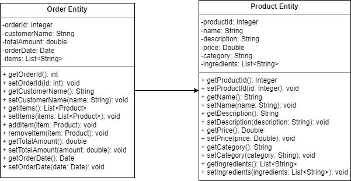

# OT-Restaurante

## This software is to manage orders and deliveries in a restaurant. With the ability to inventory ingredients, assign the chefs, queue orders and everything that involves managing the process within the restaurant.

### Entities

* Product: is a class representing a menu item or product in the restaurant.
* Order: is a class representing a customer order in the restaurant.
### UML

