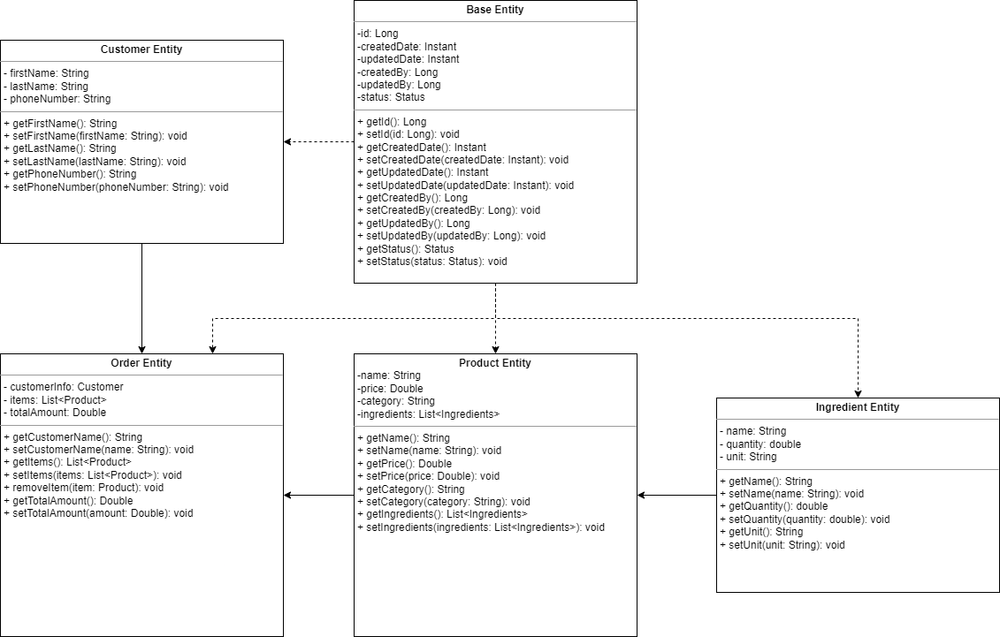

# OT-Restaurante

## This software is to manage orders and deliveries in a restaurant. With the ability to inventory ingredients, assign the chefs, queue orders and everything that involves managing the process within the restaurant.

### entities

* Product: is a class representing a menu item or product in the restaurant.
* Base: is an abstract class representing a base entity for other entities in the system.
* Customer: is a class representing a customer in the restaurant.
* Order: is a class representing a customer order in the restaurant.
* Ingredient: is a class representing an ingredient used in the restaurant.
* Person: is a class to extend to entities with humans being.
* Chef: is a class representing a chef in the restaurant.
* OrderDetails: is a class to handle the details of every order
* IoCContainer:A container for inversion of control

### UML

### Adding Maven Plugins for Code Formatting and Static Analysis

Here's how to add Maven plugins for code formatting and static analysis to your project:

You need to add Maven framework to your project, and copy the content you have in the POM.xml that we have in this 
repository

Can change version as desired, for the spotless and maven-checkstyle-plugin plugins.
Can change with the actual directory containing your source code.
For Spotless, this is typically src/main/java.
Checkstyle is configured by default for SUN rules

### Create cs_suppressions.xml, to suppress some checkstyle functions

Add the content we have in the cs_suppressions.xml to the file in your project

### Create a pre-commit file (optional):

Create a file named .pre-commit-hook (or similar) in your project's root directory with the following content:

#!/bin/sh
mvn clean
mvn spotless:check
mvn checkstyle:check

This script will run mvn clean, mvn spotless:check, and mvn checkstyle:check before every commit, ensuring your code is formatted and follows coding standards.

### Explanation:

The Spotless plugin helps you format your code according to a specific style guide. You can configure it to use various formatters like Eclipse, Google Java Format, etc.
The Checkstyle plugin performs static code analysis to identify potential coding issues like syntax errors, stylistic violations, and potential bugs.
By integrating these plugins and the pre-commit hook (if desired), you can automate code formatting and static analysis, improving code quality and consistency in your project.