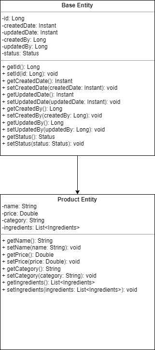

# OT-Restaurante

## This software is to manage orders and deliveries in a restaurant. With the ability to inventory ingredients, assign the chefs, queue orders and everything that involves managing the process within the restaurant.

### entities

* Product: is a class representing a menu item or product in the restaurant.
* Base: is an abstract class representing a base entity for other entities in the system.

### UML

